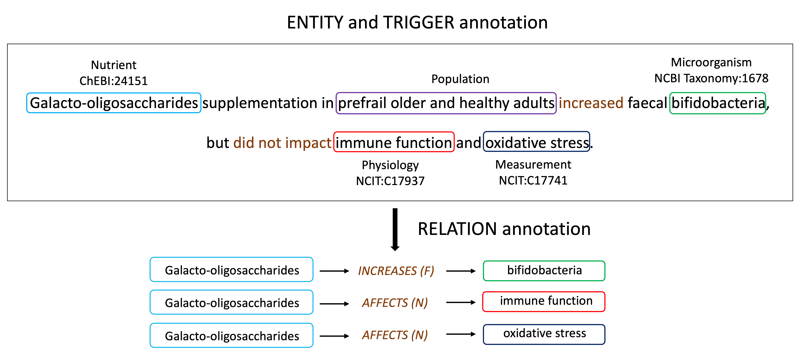

# DiMB-RE: Mining the Scientific Literature for Diet-Microbiome Associations

This repository contains (PyTorch) code, dataset, and fine-tuned models for DiMB-RE (**Di**et-**M**icro**B**iome dataset for **R**elation **E**xtraction).

**Note**: (On Feb 1st, 2025) Some functions in the repository are still under construction due to revision process, and will be updated soon. Stay tuned for further improvements and updates.

## Quick links
- [DiMB-RE: Mining the Scientific Literature for Diet-Microbiome Associations](#dimb-re-mining-the-scientific-literature-for-diet-microbiome-associations)
  - [Quick links](#quick-links)
  - [Overview](#overview)
  - [Data Preprocessing](#data-preprocessing)


## Overview

DiMB-RE is a corpus of 165 nutrition and microbiome-related publications, and we validate its usefulness with state-of-the-art pretrained language models. Specifically, we make the following contributions:

1. We annotated titles and abstracts of 165 publications with 15 entity types and 13 relation types that hold between them. To our knowledge, DiMB-RE is the largest and most diverse corpus focusing on this domain in terms of the number of entities and relations it contains.
2. In addition to titles and abstracts, we annotated Results sections of 30 articles (out of 165) to assess the impact of the information from full text.
3. To ground and contextualize relations, we annotated relation triggers and certainty information, which were previously included only in the biological event extraction corpora.
4. We normalized entity mentions to standard database identifiers (e.g., MeSH, CheBI, FoodOn) to allow aggregation for further study.
5. We trained and evaluated NER and RE models based on the state-of-the-art pretrained language models to establish robust baselines for this corpus. 

Further details regarding this study are available in our [paper](https://arxiv.org/pdf/2409.19581.pdf).


## Data Preprocessing
We preprocessed our raw dataset to fit into the input format of PL-Marker and PURE, the SpanNER models we are based on. We uploaded the processed dataset for training PURE-based model, so we recommend you to use the processed input files in the `./data/DiMB-RE` folder. Specifically, we encourage users to use `ner_reduced_v6.1_trg_abs_result` which includes annotations of result section for training data.

We also put our raw dataset which are formatted in BRAT style. If you want to check or modify the preprocessing code, please refer to the notebook files in the `./preprocess` directory.

We provide modified framework for PL-Marker and PURE by integrating trigger information into the end-to-end pipeline for RE. To train each model, please refer to `./PL-Marker` and `./PURE` folder respectively.


### Input data format
We follow the protocol of the original PURE paper to construct the input: each line of the input file contains one document.

```bash
{
  # PMID (please make sure doc_key can be used to identify a certain document)
  "doc_key": "34143954",

  # sentences in the document, each sentence is a list of tokens
  "sentences": [
    [...],
    [...],
    ["Here", "we", "show", "that", "a", "lack", "of", "bifidobacteria", ...],
    ...
  ],

  # entities (boundaries and entity type) in each sentence
  "ner": [
    [...],
    [...],
    [[78, 78, "Microorganism"], [88, 90, "Nutrient"], ...], # start and end indices are document-level, token-based spans 
    ...,
  ],

  # triggers (boundaries and entity type) in each sentence
  "triggers": [
    [...],
    [...],
    [[100, 101, "NEG_ASSOCIATED_WITH"]], # Same with the format of ner values.
    ...,
  ],

  # relations (spans of entity pair (in the order of Agent -> Theme), relation type, and factuality value) in each sentence
  "relations": [
    [...],
    [...],
    [[78, 78, 102, 103, "NEG_ASSOCIATED_WITH", "Factual"], [78, 78, 105, 106, "NEG_ASSOCIATED_WITH", "Factual"]], 
    ...
  ],

  # triplets (spans of entity pair (in the order of Agent -> Theme) and trigger mention, relation type) in each sentence
  "triplets": [
    [...],
    [...],
    [[78, 78, 102, 103, 100, 101, "NEG_ASSOCIATED_WITH"], [78, 78, 105, 106, 100, 101, "NEG_ASSOCIATED_WITH"]], # We require the information of trigger mention spans to pass them as inputs for triplet classification
    ...
  ]
}
```

## Citation
If you utilize our code in your research, please reference our work:
```bibtex
@misc{hong2024dimbreminingscientificliterature,
      title={DiMB-RE: Mining the Scientific Literature for Diet-Microbiome Associations}, 
      author={Gibong Hong and Veronica Hindle and Nadine M. Veasley and Hannah D. Holscher and Halil Kilicoglu},
      year={2024},
      eprint={2409.19581},
      archivePrefix={arXiv},
      primaryClass={cs.CL},
      url={https://arxiv.org/abs/2409.19581}, 
}
```
